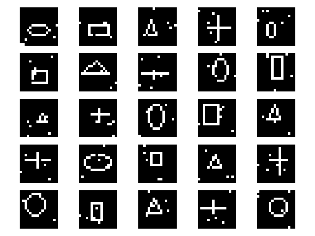
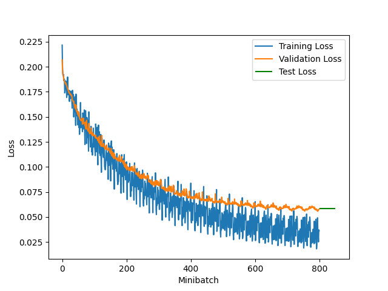

# Description

Implementation of the backpropagation algorithm in Python with numpy. Also includes a image dataset generator.

This project was developed as an assignment for a [course on Deep Learning at NTNU](https://www.ntnu.edu/studies/courses/IT3030).

# Usage
```sh
python3 backpropagation.py <config_file>
```

# Configuration
Every parameter is configurable using the configuration file, including the images generated by the dataset, the network and the layers.

Supports linear, sigmoid, tanh and ReLU activation functions as well as MSE and cross-entropy loss functions. Softmax layers are also supported.

The dataset generator supports ellipses, rectangles, triangles and crosses.

# Example outputs

